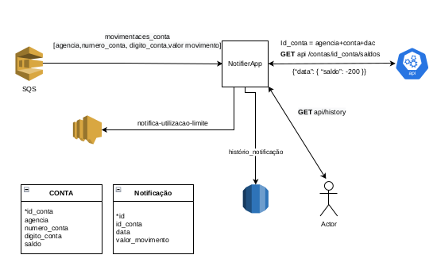

# NotifierApp

App utilizando Java 11 e Springboot que gera uma notificação (AWS SNS) quando uma movimentação financeira enviada por fila (SQS), somada ao saldo do cliente, obtido através de uma api externa (Wiremock) retorna um valor negativo.
Além disso, possui um endpoint (/historico) que recupera todas as notificações registradas no banco notifications (MySQL).
App rodando a partir de containers.

- Diagrama geral da arquitetura
  

- Install
```
git clone
```
```
./gradle clean build
```

- run
```
./docker/docker-compose up
```

- Endpoints

@GET /historico
Retorna todas as notificações que foram criadas no banco.

- Testes
  * gerando noticação
```
  aws --endpoint-url http://localhost:9324 sqs send-message --queue-url http://localhost:9324/queue/default --message-body '{"agencia":123,"numero_conta":123456,"digito_conta":1,"valor_movimento":-200}'
```
  * Não gera noticação
```
  aws --endpoint-url http://localhost:9324 sqs send-message --queue-url http://localhost:9324/queue/default --message-body '{"agencia":123,"numero_conta":123456,"digito_conta":1,"valor_movimento":200}'
```
  * Retorna que a conta não foi encontrada na API e não faz trativa.
```
  aws --endpoint-url http://localhost:9324 sqs send-message --queue-url http://localhost:9324/queue/default --message-body '{"agencia":123,"numero_conta":1234567,"digito_conta":1,"valor_movimento":200}'
```
